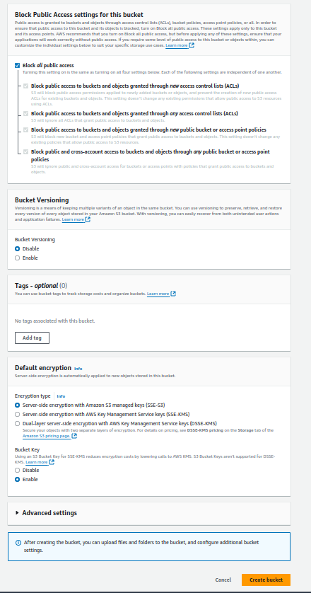
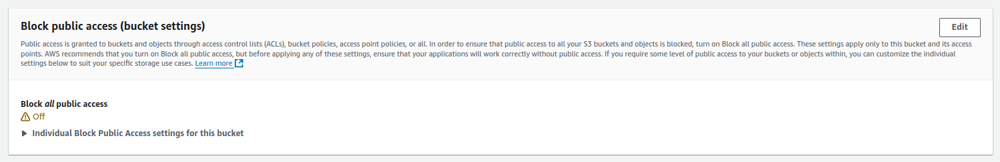

# Steps to run the app with amazon s3 integration

- From your account get those credentials ( AWS_ENDPOINT, BUCKETKEY, BUCKETSECRET, BUCKETREGION, BUCKETNAME, AWS_DIRECTORY ) and set them in .env file

# Steps to get the credentials

# Step 1: Log in to AWS Management Console

1. Go to AWS Management Console.

2. Sign in with your AWS credentials.

# Step 2: Create an S3 Bucket

1. From the AWS Management Console, search for S3 in the search bar and click on S3 to open the S3 service.

2. Click on Create bucket.

3. In the Bucket name field, enter a unique name for your bucket.

4. Choose an AWS region where you want the bucket to be hosted.

5. Configure the remaining settings (e.g., object ownership, public access, encryption) based on your requirements.

6. Click Create bucket at the bottom to create your S3 bucket.

   

   

# Step 3: Set Bucket Permissions (Optional)

If you want to allow public access to the files in the bucket, you can adjust the bucket's permissions:

1. After creating the bucket, select it from the S3 dashboard.

2. Navigate to the Permissions tab.

3. In the Block public access settings, click Edit and adjust based on your needs.

4. Optionally, you can add a bucket policy under the Bucket Policy section to grant access to specific AWS services or users.

   

# Step 4: Create an IAM User with S3 Permissions

1. In the AWS Management Console, search for IAM and click to open the IAM service.

2. From the IAM Dashboard, click Users and then Add user.

3. Provide a username, select Programmatic access, and click Next.

4. In the Set permissions step, select Attach policies directly.

5. Search for the AmazonS3FullAccess policy and select it (or create a custom policy if you want more fine-grained control).

6. Complete the rest of the steps, and finally, you will get an Access Key ID and Secret Access Key.

   #### Important: Save these keys, as you will need them to connect your application to S3.

   

   

   

## 1. AWS_ENDPOINT

- What it is: The AWS S3 endpoint is the URL that your S3 bucket is hosted at. For most general usage, this will be automatically handled by the AWS SDK, and you may not need to specify it unless you’re using a custom S3-compatible service or an alternative region.

- How to get it:
  - If you're using the standard S3 service, this will typically be auto-configured based on the region (e.g., https://s3.amazonaws.com or https://s3.region.amazonaws.com).
  - For custom endpoints (e.g., for a specific region or if you are using an S3-compatible service), you can get the endpoint by following this format: https://s3.[region].amazonaws.com, where [region] is your specific region (like us-west-1 or eu-central-1).
  - Example: AWS_ENDPOINT=https://s3.us-west-2.amazonaws.com

## 2. BUCKETKEY and BUCKETSECRET

- What they are: These correspond to the AWS access credentials:

  - BUCKETKEY: This is the Access Key ID.

  - BUCKETSECRET: This is the Secret Access Key.

- How to get them:

  1. In the AWS Management Console, go to the IAM service.

  2. Navigate to Users in the left sidebar.

  3. Select the user you want to grant access to S3 (or create a new user with programmatic access).

  4. Under the user details, you’ll find Security credentials.

  5. You can either create a new access key by clicking Create access key (for a programmatic user) or find the existing keys there.

  6. You will be provided the Access Key ID and Secret Access Key once you generate the key.

  - Example: BUCKETKEY=your-access-key-id, BUCKETSECRET=your-secret-access-key

    

## 3. BUCKETREGION

- What it is: This is the region where your S3 bucket is hosted.

- How to get it:

  1. In the AWS Management Console, go to the S3 service.

  2. Your bucket name will be listed on the Buckets page.

  - Example: BUCKETNAME=my-awesome-bucket

    

    

## 4. AWS_DIRECTORY

- What it is: This is a directory or folder within the S3 bucket where you want to store files (essentially a key prefix).

- How to get it:

  - If your bucket is already structured with directories or folders, you can just specify the folder path here. For example, if you want to store files in the uploads folder within the bucket, you can set this as uploads/.

  - If no folder exists yet, you can create one when you upload files by setting the file key to include the directory path (e.g., uploads/myfile.txt).

  - Example: AWS_DIRECTORY=uploads/

    

### Example .env file

- AWS_ENDPOINT=https://s3.us-west-2.amazonaws.com

- BUCKETKEY=your-access-key-id

- BUCKETSECRET=your-secret-access-key

- BUCKETREGION=us-west-2

- BUCKETNAME=my-awesome-bucket

- AWS_DIRECTORY=uploads/
