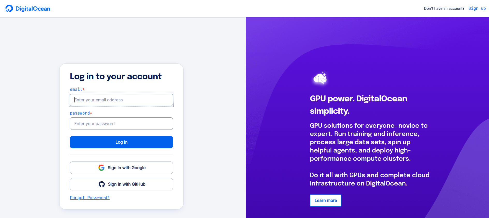
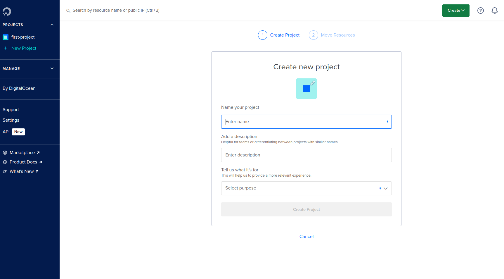
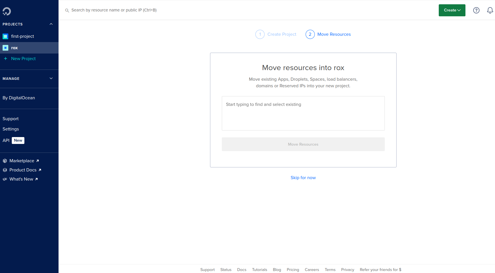
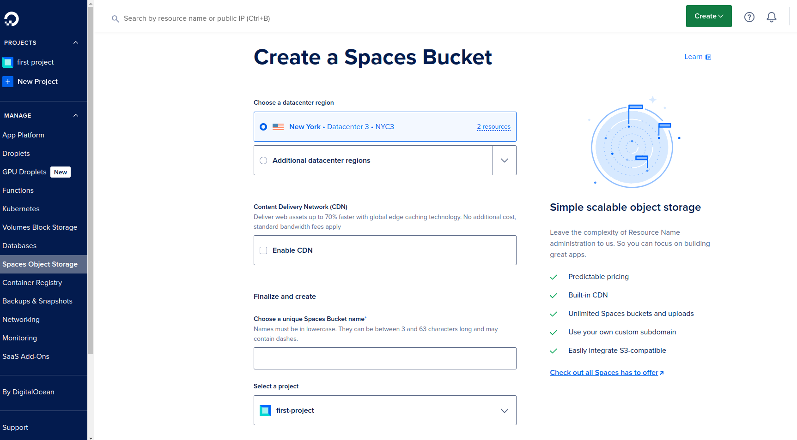
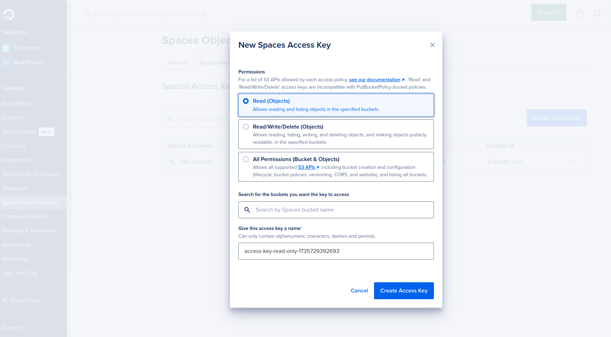
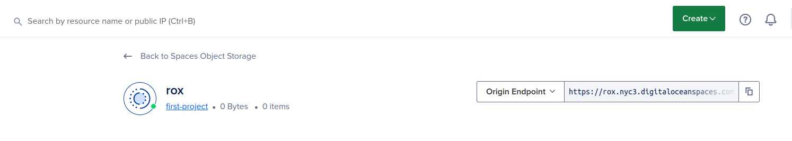

# Steps to run the app with hetzner integration

- Step 1: Go to [the digital ocean dashboard](https://cloud.digitalocean.com/login).

- Step 2: Login if you have account or register.

- 

- Step 3: Create new project

- 

- 

- Step 4: Click on the Spaces Object Storage from the left side menu and then click on create bucket

- 

- Step 5: Click on access key from Spaces Object Storage then click on create access key

- 

- Step 6: under the created access key name store it and don't forget to copy your secret key then store it

- Step 7: Go back to buckets and click on the created bucket, you will find Digital Ocean Space URL store it

- 

### Example .env file

- Digital Ocean Space URL = YOUR STORED DIGITAL OCEAN SPACE URL

- BUCKETKEY= YOUR ACCESS KEY

- BUCKETSECRET= YOUR ACCESS SECRET
