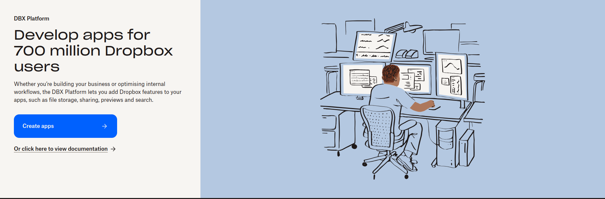
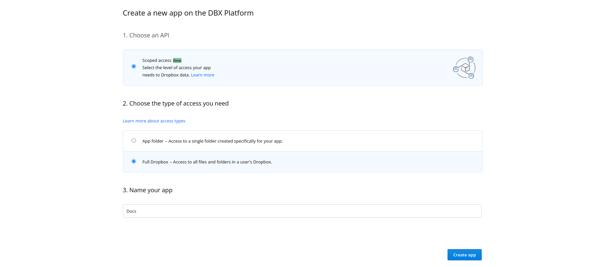
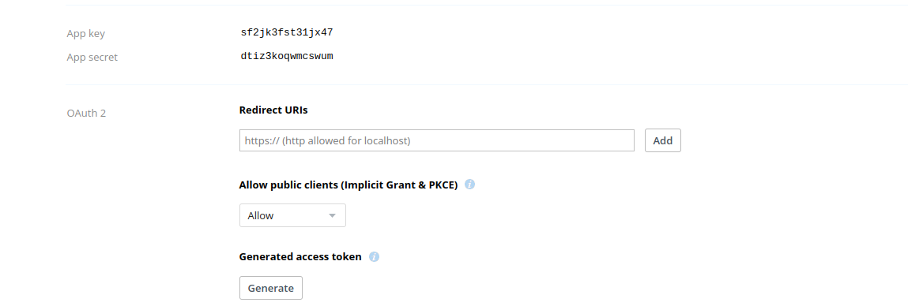

# Steps to run the app with dropbox integration

- Step 1: Go to [the Dropbox Developer Console](https://www.dropbox.com/developers).

- Step 2: Click on Create app.

- 

- Step 4: Choose the type of access your app needs ( select scoped access )

- Step 5: Choose the type of access you need ( select Full Dropbox )

- Step 6: Name your app and click create

- 

- Step 7: Click on permissions section and select (contacts.read, contacts.write, file_requests.read, file_requests.write, files.content.read, files.content.write files.metadata.read, files.metadata.write, sharing.read, sharing.write)

- Step 8: Click on settings section and get DROPBOX_CLIENT_ID ( called App key ), DROPBOX_CLIENT_SECRET ( called App secret ), set Redirect URLs ( must end with auth-redirect ex:https://yourdomain:portnumber/auth-redirect ) and click on generate access token

- 

- Finally set those tokens in your .env file