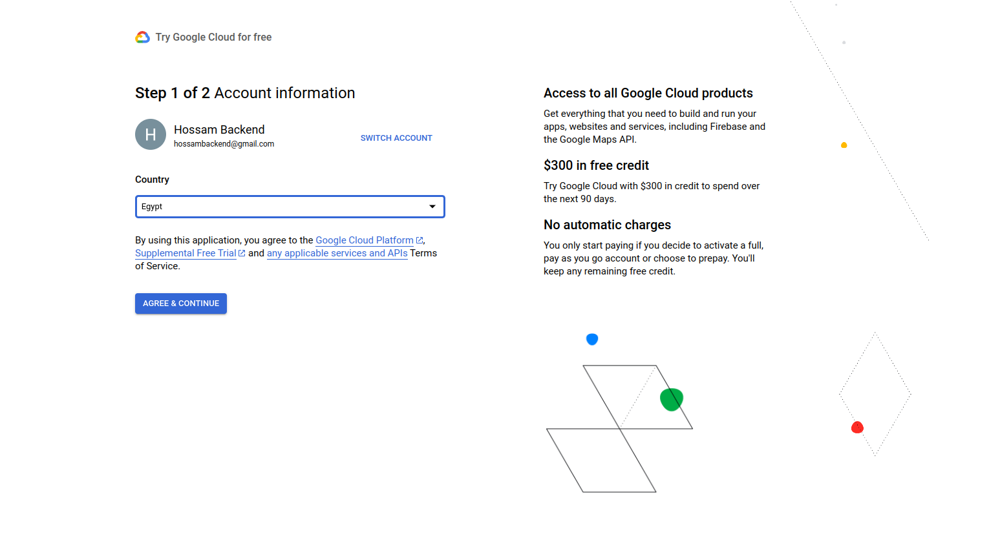
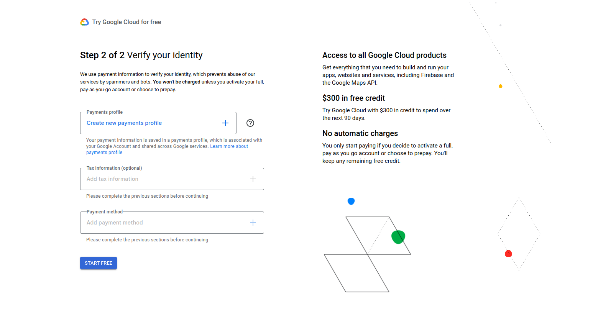
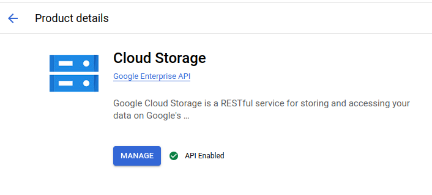
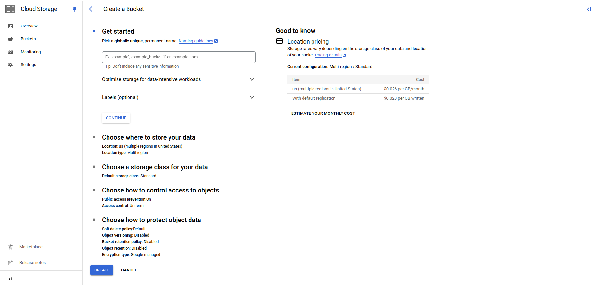
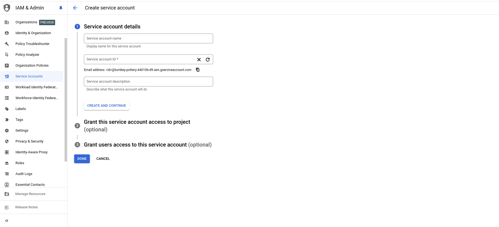
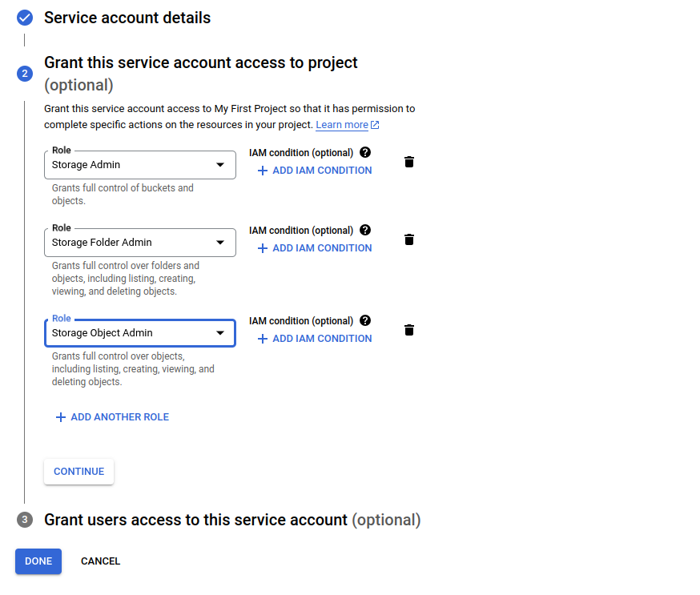
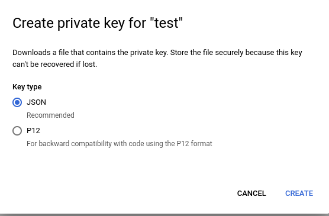

# Google Cloud Storage Integration

## 1. Setting Up Google Cloud Storage

#### Step 1: Create a Google Cloud Project
    
- Fill the required data.

    

    

#### Step 2: Enable Google Cloud Storage API

1. In the Google Cloud Console, navigate to APIs & Services > Library.

2. Search for Cloud Storage and click Enable on the Cloud Storage API.

   

#### Step 3: Create a Storage Bucket

1. Go to the Cloud Storage from navigation menu and select buckets.

2. Click on Create bucket.

3. Fill the data based on your needs

   

## 2. Set Up Google Cloud Service Account

#### Step 1: Create a Service Account with Permissions

1. Navigate to IAM & Admin > Service Accounts in the Google Cloud Console.

2. Click on + Create Service Account button.

    

    - important note : you must select the following roles to be able to set and get your data

    

3. fill the reset of the data based on your needs.

#### Step 2: Generate a Service Account Key

1. In the Service Accounts page, locate the newly created service account.

2. Click on the Actions menu (three dots) next to the account and select Manage keys.

3. Click Add Key > Create new key.

4. Choose JSON format and click Create to download the key file (e.g., google-cloud-storage.json you must rename the file to the name i mentioned).

    - Important: Store this JSON file securely. Avoid sharing it, as it contains sensitive credentials.

5. Place this JSON file in the root of your project folder and ensure it’s accessible by your application.

    

## 3. Set Up Environment Variables

In your project’s .env file, add the following configurations:

- GOOGLEBUCKETNAME = Bucket name
- GOOGLEBUCKETKEY = Project ID ( get it from json file you downloaded )
