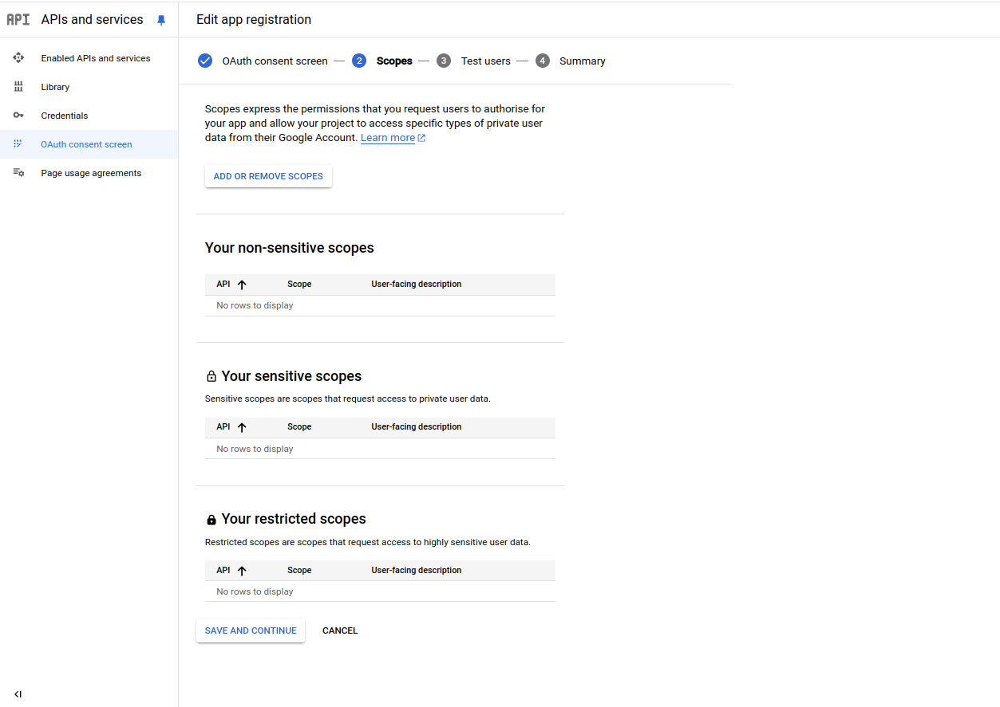
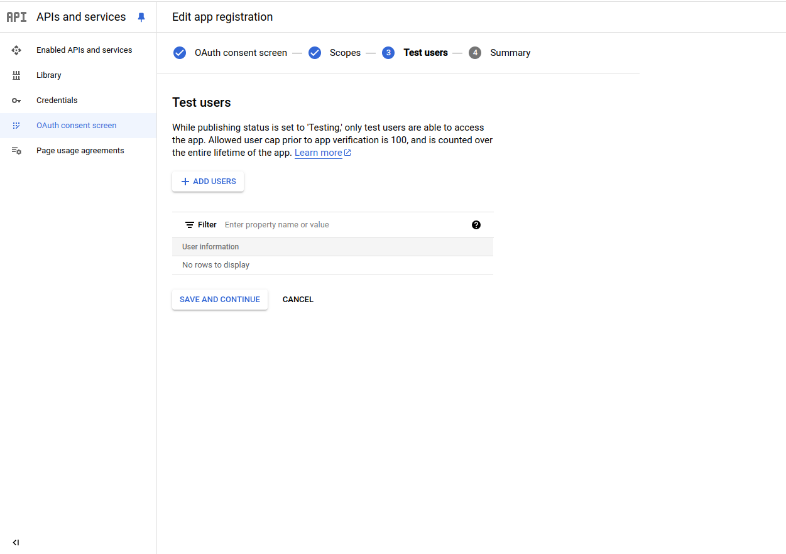

# Steps to run the app with google drive integration

- Enter on google cloud console : https://console.cloud.google.com
- Sign in or create new account
- create new project and fill the data then click create

- 

- from the notifications select the project

- 

- from the left side menu choose Enabled APIs and services and then click on plus button ENABLE APIS AND SERVICES

- 

- from Google Workspace section select Google Drive API

- 

- select from the left side menu Credentials, click on the plus button CREATE CREDENTIALS, choose OAuth client ID and click on Configure consent screen button

- 

- select External option and click on create

- 

- enter your details click save and continue

- 

- click on ADD OR REMOVE SCOPES

- 

- select these scopes to be able to access files and make operations on

- 

- in test mode you must add test users

- 

- go back again to credentials page, click on create credentials and choose again OAuth client ID

- choose Web application

- 

- enter your data 

- 

- now the most important part is to set Authorised redirect URIs the URI your will enter must end with auth-redirect ex:https://yourdomain:portnumber/auth-redirect

- 

- after clicking create download the json file on your computer then create a file called credentials.json and put the downloaded file content on it
