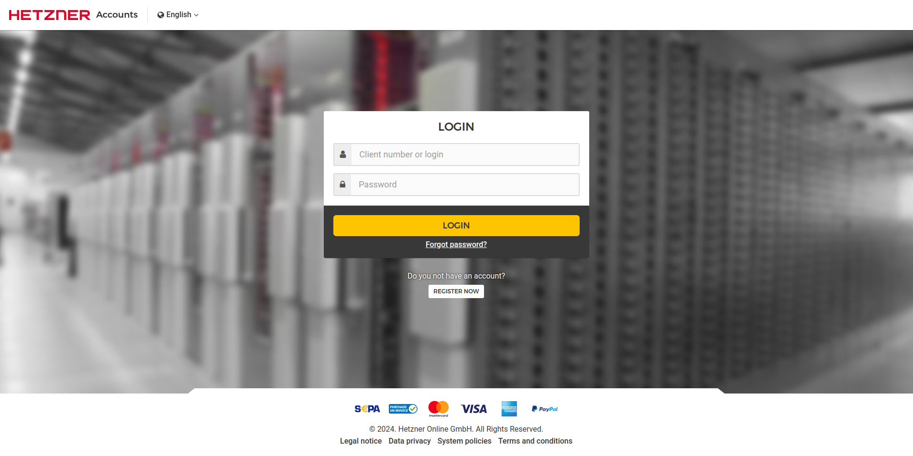
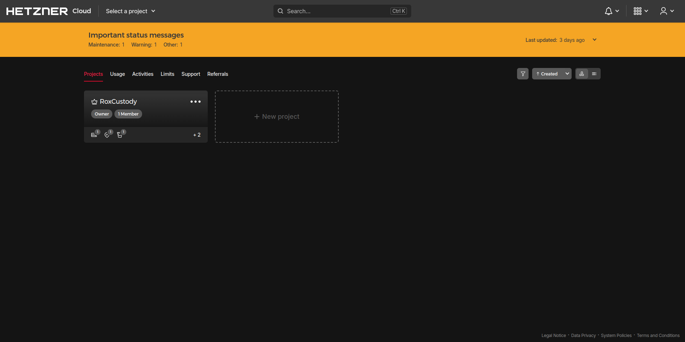
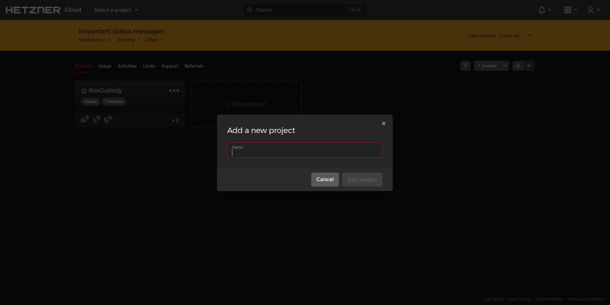
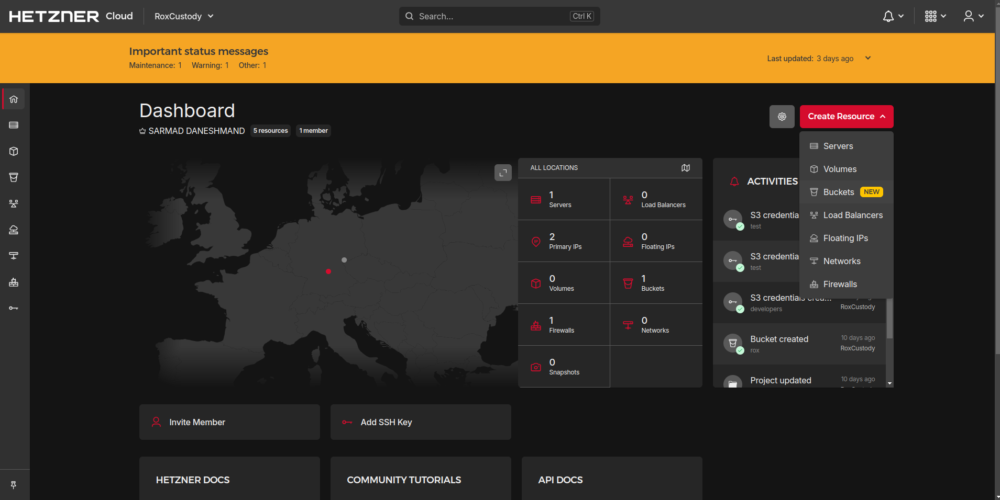
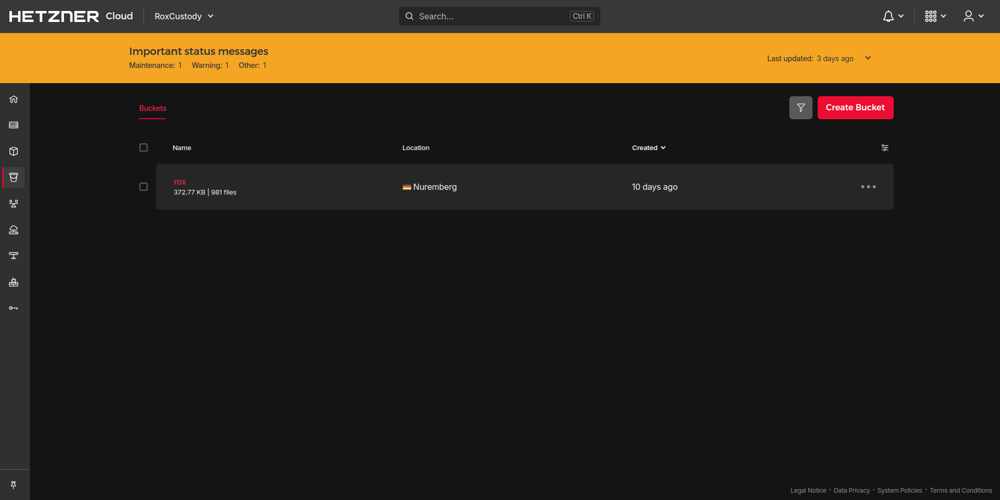
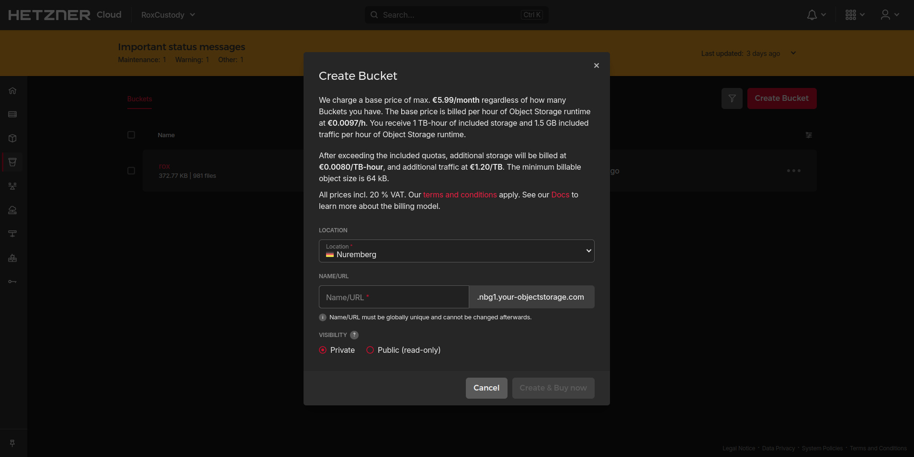
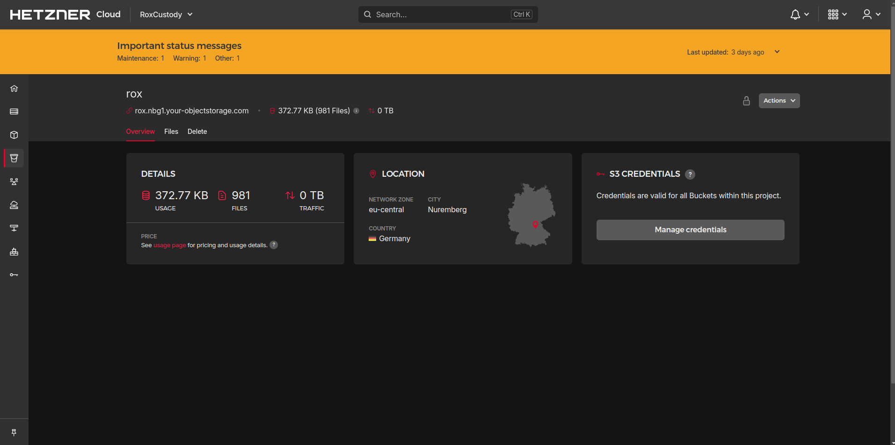
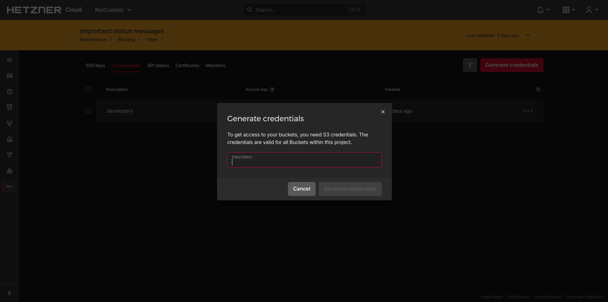
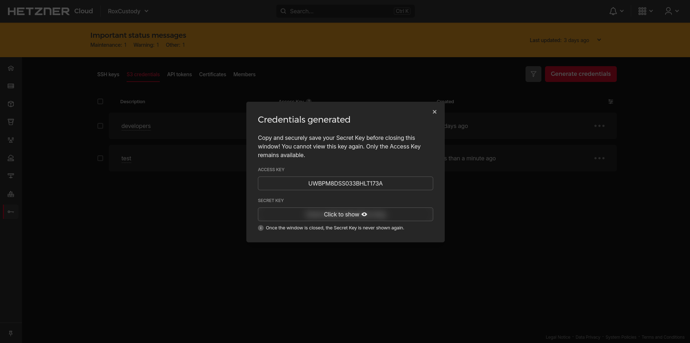

# Steps to run the app with hetzner integration

- Step 1: Go to [the hetzner dashboard](https://accounts.hetzner.com/login).

- Step 2: Login if you have account or register.

- 

- Step 3: Create new project and type a name

- 

- 

- Step 4: Click on the created project, click on create resource button and choose buckets option

- 

- Step 5: Click on create bucket button, fill the data then store bucket name for the use in Hetzner Object Storage URL bucket name

- 

- 

- Step 6: Click on the created bucket, under the bucket name you will find a link that includes location in our example it is nbg1 store this for the use in Hetzner Object Storage URL location then click on manage credentials button

- 

- Step 7: Click on generate credentials button, fill the description then store ACCESS KEY && SECRET KEY

- 

- 

### Example .env file

- BUCKETKEY = YOUR ACCESS KEY

- BUCKETSECRET= YOUR SECRET KEY

- BUCKETREGION= FROM THE LINK THAT INCLUDES THE LOCATION EX: nbg1

- BUCKETNAME = NAME OF CREATED BUCKET
