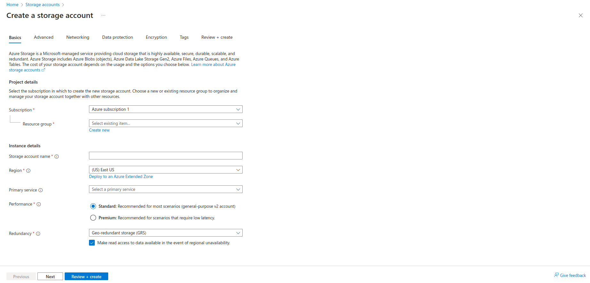
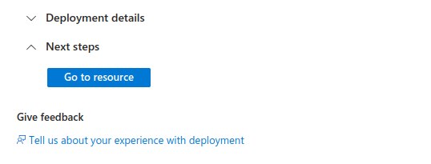
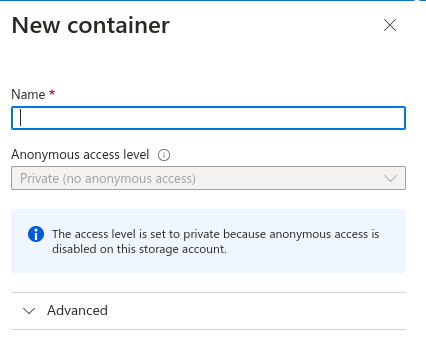
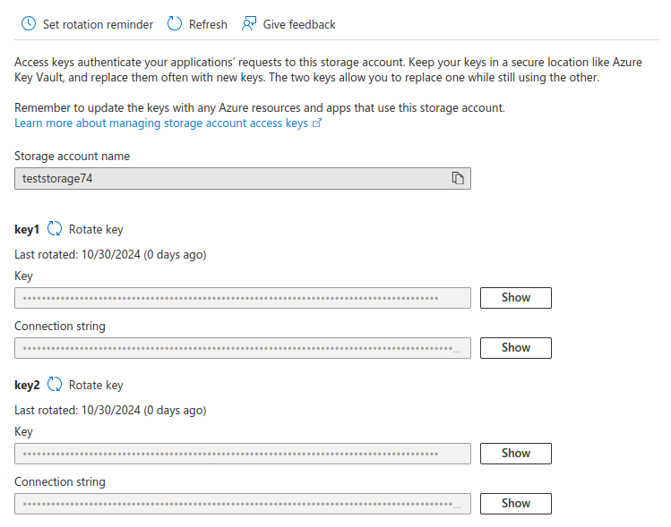

# Microsoft Azure Integration

## Step 1: Set Up Azure Storage Account and Container

#### 1.1 Create a Storage Account
    
1. Go to the Azure Portal.

2. Search for Storage accounts and select it.

3. Click on + Create to add a new storage account.

4. Fill out the required details:

    - Subscription: Select your Azure subscription.

    - Resource Group: Select an existing group or create a new one.

    - Storage Account Name: Enter a unique name for your storage account.

    - Region: Choose a region for hosting your storage.

        

5. Click Review + Create to create the account.

#### 1.2 Create a Blob Container

1. In the Storage account dashboard click on go to resource, navigate to Containers under Data storage.

2. Click + Container and enter a name.

3. Set the Public access level (usually "Private" for controlled access).

4. Click Create.

    - Set the container name in .env:

        - AZURE_CONTAINER_NAME=your-container-name

            

            

## Step 2: Access Storage Account Credentials

1. Go to your new Storage Account in the Azure Portal.

2. In the left sidebar, select Access keys under the Security + networking section.

3. You’ll see Key1 and Key2 listed, each with:

    - Storage account name: Use this for AZURE_STORAGE_ACCOUNT_NAME.

    - Key: Use this as AZURE_STORAGE_ACCOUNT_KEY.

      

4. Copy the Storage account name and Key1 value for configuring your environment.

    - Set the storage account name and key in .env:

        - AZURE_STORAGE_ACCOUNT_NAME=your-storage-account-name

        - AZURE_STORAGE_ACCOUNT_KEY=your-storage-account-key

5. Finally your .env file must be like this:
    
    - AZURE_STORAGE_ACCOUNT_NAME=your-storage-account-name

    - AZURE_STORAGE_ACCOUNT_KEY=your-storage-account-key

    - AZURE_CONTAINER_NAME=your-container-name

    - AZURE_ENDPOINT=https://Your Azure Storage Account Name.blob.core.windows.net

