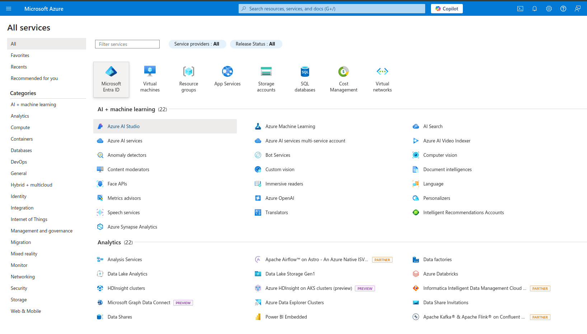

# Steps to run the app with onedrive integration

- Enter on google cloud console : https://portal.azure.com
- Sign in or create new account

- click on Microsoft Entra ID

- 

- from the overview option click on Add application registration

- 

- Enter name, and choose the selected option in the screen for supported account types and in redirect url choose Web platform with the link of your domain followed by auth-redirect ex:https://yourdomain:portnumber/auth-redirect (it is obligatory)

- create a json file called credentials and make object called onedrive and add this keys "onedrive": {
    "client_id": "get it from overview page (Application (client) ID)",
    "client_secret": "go to Certificates & secrets selection in the manage section from the menu and add new client secret",
    "redirect_uri": "add your created redirect_uri",
    "token_url": "https://login.microsoftonline.com/common/oauth2/v2.0/token", this is your token_url
    "scope": "https://graph.microsoft.com/.default offline_access", this is your scope
    "authority": "https://login.microsoftonline.com/common" this is your authority
  }

- Now go to API permissions and Add these permissions ( select microsoft graph (delegated permissions) --> choose offline_access permission and the search for files choose all Files permissions ) make the same for Application permissions option.

- 

- 